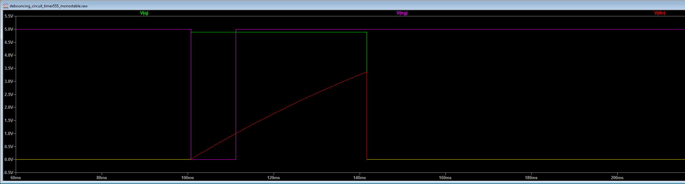
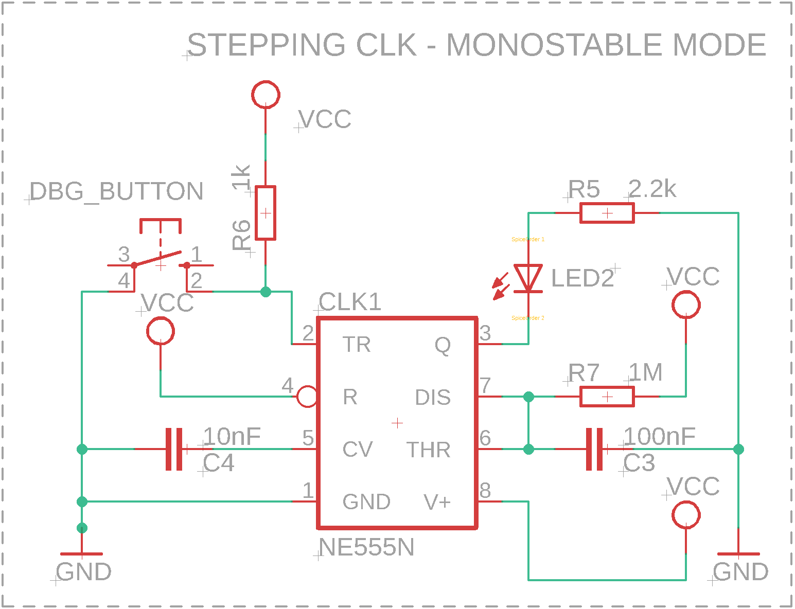
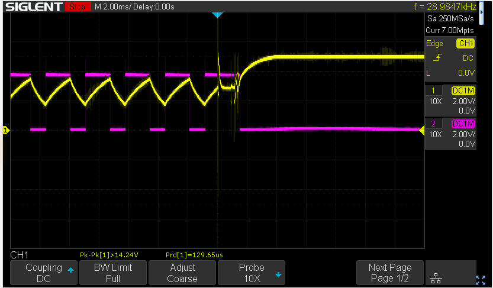
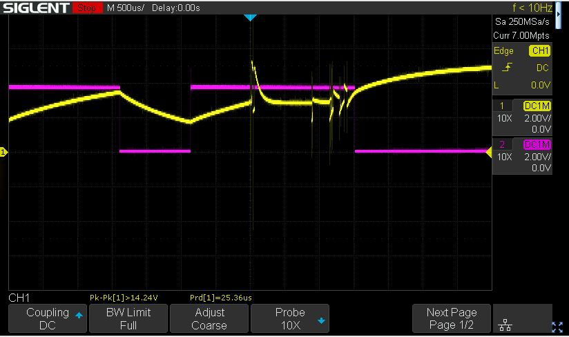
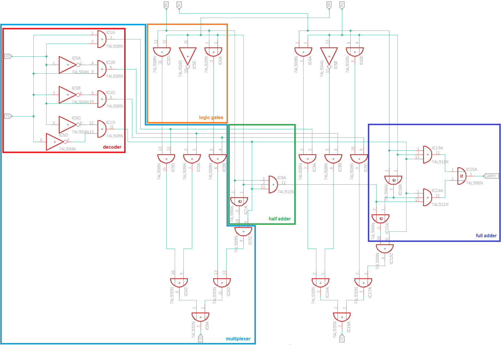
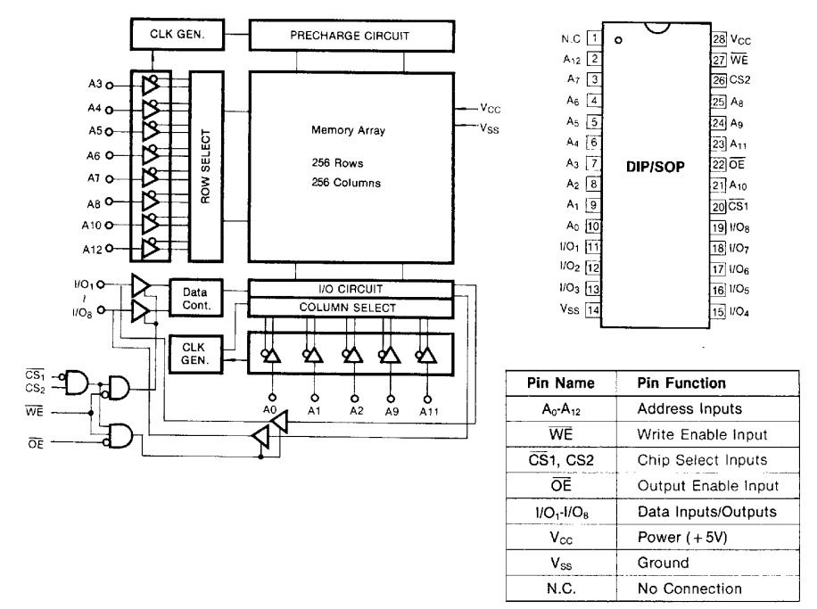

# Hardware Architecture Spec
## 1. Overview
The main purpose of this document is to describe hardware architecture of presented solution.
This 8bit computer was created based on hight level architecture of 16bit MARIE (Machine
Architecture that is Really Intuitive and Easy) described in book "The Essentials of Computer
Organization and Architecture" written by L.M. Null & J.M. Lobur. It was created for educational
purposes.

## 2. Clock
Main clock was done based on popular timer 555 designed by Hans Camenzind in 1971.
For this project we used the most popular NE555 IC (Integrated Circuit) provided by Signetics.
However it can be easily replaced by for instance LM555 introduced by Texas Instruments.
Reference to the documentation may be found here:
- NE555: https://www.ti.com/lit/ds/symlink/ne555.pdf
- LM555: https://www.ti.com/lit/ds/symlink/lm555.pdf

It's also well described at [wiki page](https://en.wikipedia.org/wiki/555_timer_IC)

### 2.1 Continous mode
For our application NE555 runs in **astable mode**. The mode is used to continously stream of digital pulses
in configured period. This configuration is done by adding connection between `THR` (threshold) and `TRIG`
(trigger) pins connected with supply voltage through the potentiometer (R2), resistor (R3), resistor (R1)
and capacitor (C2). Resistor R3 was added only to determine value of minimal resistance - to limit voltage
when potentiometr R2 is set to 0 ohms, it's important for bipolar timers to keep output saturated near the zero
volts during discharge. Due to this connection we can keep same voltage on both pins (see `Note` below
for more details). Duty cycle depends on resistence of potentiometer, two resistors (R2 + R3, and R1) and value
of capacitor (C2). The idea is simple, capacitor voltage triggers internal latch to change the state. From "1"
to "0" during the time of capacitor discharge (C2) and from "0" to "1" during capacitor charge. Time of
charging/discharging of capacitor depends on its capacity (expressed in farads), resistance of potentiometr (R2)
and resistors (R3 and R1 - expressed in ohms). The higher resistence the slower charging/discharging process because
capacitor have to pull (through the R2, R3, R1) / push (through the R2, R3) current. Same in terms of capacity,
the higher value of capacity the longer time needed to charge and discharge it. In that terms the potentiometr
(R2) was added to be able to easy change the frequency of the clocking signal that appears on pin `Q` (clock).
The exact schema of described connections was added below:

<div>
    <p align="center" width="100%">
        
    </p>
    <p align="center">
        <i>Figure 2.1.1: main clock circuit</i>
    </p>
</div>

> __Note__:
>
> If the voltage lower below 1/3 Vcc on TR (trigger) pin it causes internal latch to change state of "Q" pin
> to "1" and capacitor starts charging through potentiometr (R2) and resistors (R3 + R1).
> Once capacitor reaches 2/3 Vcc on THR (treshold) pin it causes internal latch to change state of "Q" pin
> to "0" and capacitor starts discharging throught potentiometr (R2) and resistor (R3).
> That is why it's important to keep same voltage on both pins TR and THR
> Internal transistor inside the timer are resposnsible for charge/discharge switching.
> Signal transformation observed on osciloscope was added below. The reference power supply (Vcc) is equal to 5V,
> the potentiometer was turned into 0 ohms.
> - channel 1 (yellow) shows the output from capacitor C2, as you can see voltage oscillate between
> 1/3 Vcc and 2/3 Vcc.
> - channel 2 (pink) shows the output on pin "Q" (clock)
>
> <p align="center" width="100%">
>     
> </p>
> <p align="center">
>    <i>Figure 2.1.2: main clock pulse generation</i>
> </p>


The time of signal "1" (high) of each pulse can be count as follow:

```math
t_h =  ln(2) * (R1 + R2 + R3) * C2
```

The time of signal "0" (low) of each pulse can be count as follow:

```math
t_l =  ln(2) * (R2 + R3) * C2
```

In that terms frequency is:

```math
f = \frac{1}{t_h +t_l} = \frac{1}{ln(2) * (R1 + 2(R2 + R3)) * C2}
```

and duty cycle is equal to:

```math
D = \frac{t_h}{t_h +t_l} * 100 = \frac{R1 + R2 + R3}{R1 + 2(R2 + R3)} * 100
```

### 2.2 Stepping mode
Stepping mode is usefull for debugging purposes. It's necessary to be able to trigger a single clock signal
to debug code execution of single instruction processed by ALU (Arthmeric and Logical Unit) of CPU (Central
Processing Unit). Single pulse can be easily triggered by switch button added between Vcc and GND however it
may lead to multiple pulses triggered by bouncing connectors of the switch during the button push. It was
shown on figure below, where single button push has tiggered two pulses:

<div>
    <p align="center" width="100%">
        
    </p>
    <p align="center">
        <i>Figure 2.2.1 debug button bouncing issue</i>
    </p>
</div>


This issue is well known and there are many possible solutions used to reduce noise caused by bounced connectors of
the switch like additional schmitt trigger added to circuit, digital flip-flop, properly configured counters and
so on. In our case we will use the same component as before (used for general clock) NE555 running this
time in **monostable mode**. Reduction of connectors bounce is possible due to internal construction of the chip.
NE555 has SR latch inside (Set-Reset flip-flop), which can be used to reduce the noise. To demonstrate this
issue model of NE555 timer in monostable mode was prepared in ltspice simulator
(clock/ltspice/ne555n-monostable-debouncing):

<div>
    <p align="center" width="100%">
        
    </p>
    <p align="center">
        <i>Figure 2.2.2: schema of timer555 in monostable mode (ltspice simulator)</i>
    </p>
</div>

NE555 produce single pulse when the `THR` signal drops below 1/3 Vcc. Duration of the pulse depends on time needed
to charge capacitor C3 to 2/3 Vcc. It can be expressed by following equation:

```math
t = ln(3) * R7 * C3
```

Additional circuit with voltage controlled switch at the bottom left corrner was added to simulate switch bouncing
issue. Simulation run shows following results:

<div>
    <p align="center" width="100%">
        
    </p>
    <p align="center">
        <i>Figure 2.2.3: ltspice simulation results for timer 555 in monostable mode - common case</i>
    </p>
</div>

Where output pulse V(q) (marked green) was intentionally lowered to 4.9V to increase readability of the chart.
V(thr) (marked red) shows us C3 charging process through the resistor R7, and then immediate drop after it
reach 2/3 Vcc limit. Drop goes immediate because there is no resistior plugged between discharging transistor (Q1)
and GND. The last signal V(trg) (marked pink) shows trigger signal. The most important is the fact that even if
situation showed at the beging of the section (Figure 2.2.1) happens the circuit still works and only single
pulse will be generated:


<div>
    <p align="center" width="100%">
        
    </p>
    <p align="center">
        <i>Figure 2.2.4: ltspice simulation results for timer 555 in monostable mode - bouncing trigger</i>
    </p>
</div>


Full schema for debouncing circuit used for stepping mode (debug purposes) was added bellow:

<div>
    <p align="center" width="100%">
        
    </p>
    <p align="center">
        <i>Figure 2.2.5: stepping clock circuit</i>
    </p>
</div>

Based on these configutations:

 - NE555 in astable mode: main clock (figure 2.1.1)
 - NE555 in monostable mode: stepping clock (figure 2.2.5)

We can construct clock circuit. On the one hand **astable mode** will be used as an operational mode of the clock
to continously generate digital clocking signal, on the other hand **astable mode** will be used as a debug mode
of the clock to generate single clocking signal trigger by debounced pushed button (NE555 chip resposibility in this
configuration is limited to debounce the signal produced by button push).

Many different configurations can be introduced for such circuit. Some of them may use NE555 timer, other may use
different circuites. For instance a bit different module based on the same chip NE555 was created by Ben Eater, proper
schema is provided [here](https://eater.net/8bit/clock). The circuit uses three NE555 chips configured in
three different modes: astable, monostable and bistable. Two of them were described in this document the third
configuration (bistable) was used to debounce SPDT (Single Pole Double Throw) switch used to select betweem NE555
in astable and monostable modes. It's a great example that can be used to learn all of the most common configurations
of NE555 timer, and how to create and optimize basic logic-gate circuits using Karnaugh map and De Morgan's
laws to unify all gates to the functional complete type of gates (NAND or NOR). However this circuit is using a lot
of chips to perform one simple task. For this project we will use much simplier circuit which will use one NE555 timer
that could be switched in one of two modes (astable and monostable) using SPDT switch and two transistors. We will
use two different types of transistors one bipolar PNP transistor (controlled by current) and unipolar N-channel
MOSFET (Metal Oxide Semiconductor Field Effect Transistor - controlled by voltage). Circuit can be done also using
single type of transistors, however for this project we use two different types just for educational purposes - to
present main differences between them. The whole circuit was presented below:

<div>
    <p align="center" width="100%">
        
    </p>
    <p align="center">
        <i>Figure 2.2.6: clock circuit</i>
    </p>
</div>

To be able to switch between two different modes (astable and monostable) we need to be able to close and open
internal connection between pins `TR` (trigger), `THR` (treshold) and pin `DIS` (discharge). After disconnecting
`DIS` pin for monostable mode of NE555 we need to provide alternative way to discharge capacitor C2, which is implemented
by path on the right hand site. SPDT switch (S2) on the one hand is responsible for connecting/disconnecting this
alternative path with regular circuit and on the other hand for bipolar PNP transistor BC556 (Q1) control. When:

- switch S2 is opened (pin 2 and 3 of the switch are connected) **base** pin of the transistor is grounded. That means
that there is no current between **base** and **emiter**, and as a result **collector**-**emiter** path is opened.
It gives an oportunity to discharge the C2 capacitor over the `DIS` pin, which starts the oscillation described at the
beginning of the section - astable mode of the NE555.
- switch S2 is closed (pin 2 and 1 of the switch are connected) current flows over the **base** pin to the **emitter**
which causes the other connection between **collector** and **emiter** to close. It prevents from discharing capacitor
C2 over the `DIS` pin, at the same time it opens the alternative way to discharge it by pushing SPST (Single Pole Single
Throw) button (S1). When the button is pushed it will ground line between `TR` (trigger) and `THR` (treshold), which will
cause capacitor C2 to discharge. Voltage will be dropped bellow 1/3 of the Vcc and as a result clock signal at pin `Q` rise
(high state - 1). After the button release line will be connected back to the Vcc source, capacitor C2 will start charging,
voltage at line between pins `TR` and `THR` will rise above 2/3 of the Vcc and as a result pin `Q` will return to the default
(low state - 0) - monostable mode of the NE555.

In this case both SPDT switch (S2) and SPST debug button (S1) are debounced by internal SR latch of NE555 timer in monostable
mode. The second switch (S2) connectors bounce affects connection between `DIS` pin of NE555 and capacitor C2 as you can see
bellow, where yellow line represents the output from the line connected to the capacitor C2, and pink line represents digital
signal from the output of NE555 timer (pin `Q`):

<div>
    <p align="center" width="100%">
        
    </p>
    <p align="center">
        <i>Figure 2.2.7: SPDT switch (S2) off-on debouncing (1/2)</i>
    </p>
</div>

<div>
    <p align="center" width="100%">
        
    </p>
    <p align="center">
        <i>Figure 2.2.8: SPDT switch (S2) off-on debouncing (2/2)</i>
    </p>
</div>

<div>
    <p align="center" width="100%">
        
    </p>
    <p align="center">
        <i>Figure 2.2.9: SPDT switch (S2) on-off debouncing (1/2)</i>
    </p>
</div>

<div>
    <p align="center" width="100%">
        
    </p>
    <p align="center">
        <i>Figure 2.2.10: SPDT switch (S2) on-off debouncing (2/2)</i>
    </p>
</div>

<div>
    <p align="center" width="100%">
        
    </p>
    <p align="center">
        <i>Figure 2.2.11: SPST debug button (S1) off-on debouncing (1/2)</i>
    </p>
</div>

Notice that additional transistor was added to the output of the circuit (pin `Q`). This transistor was added to enable `HLT`
(HALT) signal, similar to the logic circuit added to the clock module presented by Ben Eater. Unipolar MOSFET N-channel
transistor (BS170) is controlled by voltage (instead of current - as it was done for bipolar PNP transistor BC556). When
the HLT line is grounted connection between the **source** and **drain** is opened, and the digital signal that goes to
the **gate** will be propageted the **drain** pin. However when the voltage on the **source** pin go high (around
Vcc value) the connection between **gate** and **drain** will be closed, and digital signal won't be propageted to the
**drain**. That saying by setting `HLT` line to the logical 0 clock signal will be propagated, and by setting it to the
logical 1 clock signal will be halted.

## 3. ALU (Arthmetic Logic Unit)

Arthmetic Logic Unit can be done based on TTL circuit 74181 described [here](https://en.wikipedia.org/wiki/74181). However
this project tries to reflect architecture described by "The Essentials of Computer Organization and Architecture" book.
A very simple ALU schema based on some logic gates was presented there in chapter 3.6. This unit can perform one basic
arthmetic operation (addion) without carry and three logic operations (AND, OR, NOT). We will use this circuit with small
change introduced to provide subtraction and carry possibilities to make the unit a bit more usefull. The original schema was
presented below:

<div>
    <p align="center" width="100%">
        
    </p>
    <p align="center">
        <i>Figure 3.1: 2-bit ALU unit, source: "The Essentials of Computer Organization and Architecture" </i>
    </p>
</div>

On the schema we can recognize few circuits:
- decoder, which in fact is a part of MUX (multiplexer), however to limit number of gates decoder was shared between two multiplexers. Each
  MUX is responsible for performing operation on two following bits of two input values.
- half adder, which can add two bits without carry, described in details by [article](https://en.wikipedia.org/wiki/Adder_(electronics)#Half_adder)
- full adder, which can perform the same operation but with carry, described in [article](https://en.wikipedia.org/wiki/Adder_(electronics)#Full_adder),
- some basic logic gates AND, OR, NOT (inverter) to perform basic logic bitwise operations


<div>
    <p align="center" width="100%">
        
    </p>
    <p align="center">
        <i>Figure 3.2: sections of 2-bit ALU unit</i>
    </p>
</div>

ALU use internal multiplexer to select (based on combination of decoder input signal F0, F1 values: b'00 [0], b'01 [1], b'10 [2], b'11 [3])
one of the four lines that provides result of logical or arthmetic operation:
- AND gate output: provides result of logical conjuction of two bits {A0; B0}, {A1; B1}
- OR gate output: provides result of logical disjunction of two bits {A0; B0}, {A1; B1}
- NOT (inverter) gate output: provides logical negation for the first number bits: A0, A1
- half/full adder circuit output: provides result of arthmetic sum of two bits {A0; B0}, {A1; B1; carry from pervious sum}

To build the prototype of ALU circuit we can use following TTL chips:
- Dual 4-line to 1-line data Multiplexer (74\*153),
- 4-bit full adder circuit (74\*283),
- logic gates: quad 2-input AND gate (74\*08), quad 2-input OR gate (74\*32), hex inverter (74\*04)

These chips are common and easy to find. However to make the unit usefull we need to provide at least one additional basic
arthmetic operation which is substraction. To understand how it was implemented some knowledge about basic represention of
numbers in digital systems is needed. The most common representation of signed integers on micro-computer is
[two's complement system](https://en.wikipedia.org/wiki/Two's_complement), where a positive number is represented as binary
number and the most significant bit is treated as a sign bit, negative number is created by invertion of all bits
and adding 1 to it. The operation overflow should be ignored. Such representation allows to avoid some basic issues like double
representation of number "0", or additional circuit to establish the correct sign bit for calculated result.

That saying substraction can be done by adding negative number to the positive number. All what we need to do is to change one of
the numbers to negative by:
- inverting all bits,
- adding "1" to it.

To invert the number XOR (Exclusive OR) gate can be used. It will invert bit value provided on one of the gate's input if second input will
be set to "1" (**control line**), otherwise it will propagate the original value of the bit. 
To add one to the inverted number we can replace original half adder circuit by full adder and pass **control line** value to it as
carry input signal.

After taking these changes into account we can build the ALU IC using six TTL chips, the final result was presented below:

<div>
    <p align="center" width="100%">
        
    </p>
    <p align="center">
        <i>Figure 3.3: 8-bit ALU unit</i>
    </p>
</div>

## 4. General Purpose Registers

General Purpose Registers are utilize by ALU unit for computations, to store temporary values and operation results. Each register
is build based on D-type flip-flops connected in sequence. Single register is 8 bits width, and was implemented with two 74\*74 TTL
chips connected together. NAT-1 has the same set of registers as original architecture of MARIE, however some of the internal
connections were modified. Following registers are present:
- **ACU** - Acumulator, general purpose registers to keep data to process by ALU. It holds also result of the performed operation.
- **MAR** - Memory Address Register, contains lower part of the memory address (RAM). It's connected directly with PC for "memory jump"
  operation. As far as PC register is responsible for address iteration, MAR register holds return address.
- **MBR** - Memory Buffer Register, contains data read from memory, or data to be written into memory. It's connected to the ALU, and
  together with **ACU** are used for computions.
- **PC** - Program Counter, contains memory address of the next instruction to be processed by ALU. It can jump to the memory address
  pointed by **MAR** register, first bit of **IR** and special purpose register **PAR** (Page Address Register). Based on the content
  of these registers poper value of the memory address used for this operation is calculated. This register is created based on JK
  flip-flops (74\*76), contrary to the rest of the registers created based on D-type flip-flops. Due to different and more complex
  internal design of the register it was described in details in separate section (see [Program Counter](##5.-Program-Counter)).
- **IR** - Instruction Register, It contains opcode (operational code) of the instruction to be processed by ALU. It's splitted into
  lower part of 4 bits long, which contains optional data which may be needed by instruction, and higher part of 4 bits long which
  contains instruction code. It gives us possibility to define 16 possible instructions described in a separate section
  (see [ISA](10.-ISA-(Instruction-Set-Architecture)).
- **IO[0-3]** - Input/Output Registers, four registers used to connect external devices/controlers to the CPU.


Following registers: MAR, MBR, PC, IR, are dedicated for specific operations. These has additional, direct connections to ALU, RAM
and other registers. These can't be used for different operations. Current state of the CPU is kept by special purpose register FLAG.
All registers are plugged into **data bus**, used for data exchange between them, as well as memory.

<div>
    <p align="center" width="100%">
        
    </p>
    <p align="center">
        <i>Figure 4.1: General Purpose Registers</i>
    </p>
</div>

## 5. Program Counter
TBD

## 6. Special Purpose Registers
TBD
- **PAR**
- **FLAG**

## 7. RAM (Random Access Memory)

NAT-1 has single memory chip. Both data to process and instructions to perform in form of program compiled to the machine code
are stored there. In general to build the main memory module one of the following type of chips can be used:
- DRAM (Dynamic Random Access Memory) - due to internal desing, where each bit of information is represented by state of internal
  capacitor (charged state coresponds to high state of bit - "1", discharged state coresponds to low state of bit - "0")
  and related charging/discharging transitor, these type of memory is usally cheaper than SRAM, and due to different approach of
  cells addressing it has reduced number of address pins (twice). However to keep the state of memory permanent over the time of
  execution it requires a specialized circuit for cells state refresh, which makes the whole memory module more complex comparing
  with modules based on SRAM chips.
- SRAM (Static Random Access Memory) - this type of chip is built based on D-type flip flops, same as shift registers. As a result
  the state of the bit is stored by inverting feedback on the circuit's gates. Memory itself is more complex then DRAM and as result
  more expensive, however it doesn't need any additional circuit for memory cells refresh (due to lack of capacitors).

This solution uses SRAM. There are plenty of chips that can be used for the final memory module implementation. In general these
chips contains:
- memory cell array to keep instruction and data to process,
- address decoder splitted into two parts, for rows and for columns where proper address lines are connected.

Size of the memory cells may be different, however the common size is set to 8 bits. Each memory cell can be build based on
few sequentialy connected D-type flip-flops, same as for shift registers. Chip 74\*74 provides dual D-type flip flops circuit,
however due to a huge number od chips needed to build memory cell array with resonable size for this application we will use large
scale memory chip [KM6264BLS-10L](https://www.datasheets360.com/pdf/-2077603173809567344) which is 8Kx8-bit high-speed Static RAM
organized as 8, 192 words by 8 bits. It's a CMOS chip with TTL compatible inputs and outputs, JEDEC Standard pin configuration and
three state output. Functional block diagram was presented below:

<div>
    <p align="center" width="100%">
        
    </p>
    <p align="center">
        <i>Figure 7.1: SRAM 8Kx8bit module KM6264BLS-10L functional block diagram, source: "KM6264BBL/KM6264BL-L datasheet"</i>
    </p>
</div>

The maximum size of address bus used for this project was reduced to 11 lines. The only reason for that is to try to reduce the
number of wires needed to construct the memory bus. On the other hand we still would like to be able to address a resonable size of memory.
Like for instance 32KB, which is the minimum size of the RAM needed to run the early Operating System like
[ISIS](https://en.wikipedia.org/wiki/ISIS_(operating_system)) (Intel Systems Implementation Supervisor) or [CP/M](https://en.wikipedia.org/wiki/CP/M)
(Control Program/Monitor). To make it possible a simple [memory paging](https://en.wikipedia.org/wiki/Memory_paging) mechanism was
added to the module. The mechanism allows to retrieve data from storage in same-size blocks called pages. At the specific moment
of code execution CPU sees only one page of memory pointed by value of [PAR](https://en.wikipedia.org/wiki/Page_address_register)
(Page Address Register). The last two address lines (`ADDR-BUS9` and `ADDR-BUS10`) are connected to the input of
[demultiplexer](https://en.wikipedia.org/wiki/Multiplexer#Digital_demultiplexers) (DEMUX), the output of DEMUX is connected to the `CS1`
(Chip Select) input of the memory chip, which makes accessible only one memory chip (out of four) during the code execution.
`PAR` is 4-bits size shift register built on D-Type Flip-Flops, for this application TTL chip 74\*173 was used.
As a memory four **KM6264BKS-10L** chips were used which gives us 4 blocks of 8KB, 32KB of memory in total devided into 2^4 (maximum
value kept by `PAR`) * 4 (number of memory chips) = 64 pages (each page of 512B). The last thing is the capability to switch memory
module between two modes:
- running mode - code execution mode,
- program mode - code load mode.

The switch was done by quadruple 2-line to 1-line data selectors: TTL 74\*157 chips. The whole schema of the memory module was presented
below:

<div>
    <p align="center" width="100%">
        
    </p>
    <p align="center">
        <i>Figure 7.2: Full RAM module schema</i>
    </p>
</div>

## 8. ROM
TBD

## 9. Control Unit
TBD
