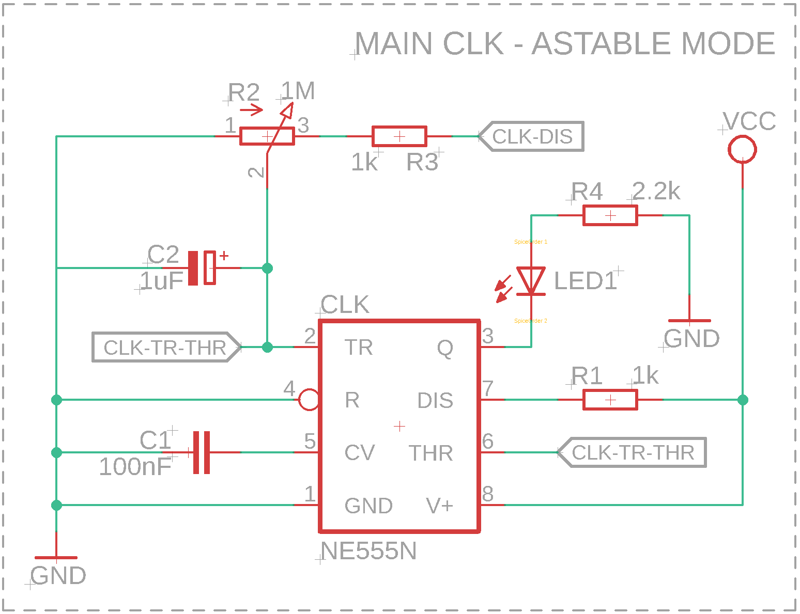
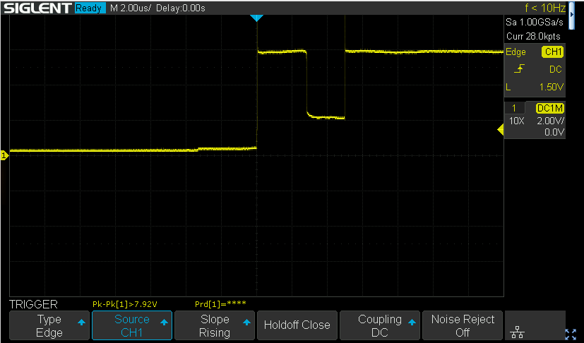
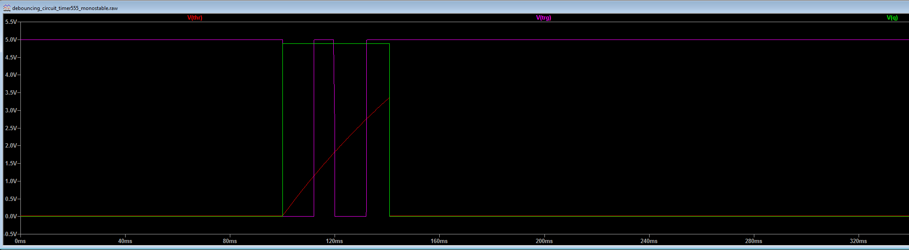

# Hardware Architecture Spec
## 1. Overview
The main purpose of this document is to describe hardware architecture of presented solution.
This 8bit computer was created based on hight level architecture of MARIE computer described
in well-known book "The Essentials of Computer Organization and Architecture" written by
L.M. Null & J.M. Lobur. It was created for educational purposes.

## 2. Clock
Main clock was done based on popular timer 555 designed by Hans Camenzind in 1971.
For this project we used NE555 IC (Integrated circuit) provided by Signetics.
However it can be easily replaced by for instance LM555 introduced by Texas Instruments.
Reference to the documentation may be found here:
- NE555: https://www.ti.com/lit/ds/symlink/ne555.pdf
- LM555: https://www.ti.com/lit/ds/symlink/lm555.pdf

It's also well described at [wiki page](https://en.wikipedia.org/wiki/555_timer_IC)

### 2.1 Continous mode
Timer555 is running in **astable mode**. Mode used to continously stream of rectangular pulses in configured
period. This configuration is done by adding connection between THR (threshold) and TRIG (trigger) pins
plugged into voltage through the potentiometer (R2), resistor (R3) (which was added only to determine minimal
value of resistance - in a case when potentiometr was turned off (0 ohms), it's important for bipolar timers
to keep output saturated near the zero volts during discharge), resistor (R1) and capacitor (C2).
Connection is done to keep same voltage on both pins (see `Note` below for more details). Duty cycle depends
on resistence of potentiometer, two resistors (R2 + R3, and R1) and value of capacitor (C2). The idea is
simple, capacitor voltage is triggering internal latch to change the state. From "1" to "0" during the time
of capacitor (C2) discharge and from "0" to "1" during capacitor charge. Time of charging/discharging of
capacitor depends on its capacity (expressed in farads) and resistance of potentiometr (R2) and resistors
(R3 and R1 - expressed in ohms). The bigger resistence the slower charging/discharging process because
capacitor have to pull (through the R2, R3, R1) / push (through the R2, R3) voltage. Same in terms of capacity,
the higher value of capacity the longer time needed to charge and discharge it. In that terms the potentiometr
(R2) was added to be able to easy change the frequency of the clocking signal that appears on pin Q (clock).
The exact schema of described connections was added below:

<div>
    <p align="center" width="60%">
        
    </p>
    <p align="center">
        <i>Figure 2.1.1: main clock circuit</i>
    </p>
</div>

> __Note__:
>
> If the voltage lower below 1/3 Vcc on TR (trigger) pin it causes internal latch to change state of "Q" pin
> to "1" and capacitor starts charging through potentiometr (R2) and resistors (R3 + R1).
> Once capacitor reaches 2/3 Vcc the on THR (treshold) pin it causes internal latch to change state of "Q" pin
> to "0" and capacitor starts discharging throught potentiometr (R2) and resistor (R3).
> That is why it's important to keep same voltage on both pins TR and THR
> Internal transistor inside the timer are resposnsible for charge/discharge switching.
> Signal transformation observed on osciloscope was added below. The reference power supply (Vcc) is equal to 5V,
> the potentiometer was turned into 0 ohms.
> - channel number 1 (yellow) schows the output from capacitor C2, as you can see voltage oscillate between
> 1/3 Vcc and 2/3 Vcc.
> - channel number 2 (pink) schows the output on pin "Q" (clock)
>
> <p align="center" width="100%">
>     
> </p>
> <p align="center">
>    <i>Figure 2.1.2: main clock pulse generation</i>
> </p>

To better understand the how the timer works you can also take a look at the schema below:


The time of signal "1" (high) of each pulse can be count as follow:

```math
t_h =  ln(2) * (R1 + R2 + R3) * C2
```

The time of signal "0" (low) of each pulse can be count as follow:

```math
t_l =  ln(2) * (R2 + R3) * C2
```

In that terms frequency is:

```math
f = \frac{1}{t_h +t_l} = \frac{1}{ln(2) * (R1 + 2(R2 + R3)) * C2}
```

and duty cycle is equal to:

```math
D = \frac{t_h}{t_h +t_l} * 100 = \frac{R1 + R2 + R3}{R1 + 2(R2 + R3)} * 100
```

### 2.2 Stepping mode
Stepping mode is usefull for debugging purposes. It's necessary to be able to trigger a single clock signal
to debug code execution of single command processed by ALU (Arthmeric and Logical Unit) of CPU (Central
Processing Unit). Single pulse can be easily triggered by switch button added between Vcc and GND however it
may lead to multiple pulses triggered by bouncing switch connectors during the button push. It was shown on figure
below, where single button push has tiggered two pulses:

<div>
    <p align="center" width="100%">
        
    </p>
    <p align="center">
        <i>Figure 2.2.1 debug button bouncing issue</i>
    </p>
</div>


This issue is well known and there are many possible solutions used to reduce noise caused by bounced connectors of
the switch like additional schmitt trigger added to circuit, digital flip-flop, properly configured counters and
so on. In our case we will use the same integrated circuit as before (used for general clock) NE555 running this
time in **monostable mode**. Reduction of connectors bounce is possible due to internal construction of the chip.
Timer555 has SR latch inside (Set-Reset flip-flop), which can be used to reduce the noise. To demonstrate this
issue model of NE555 timer in monostable mode was prepared in ltspice simulator
(ltspice/debouncing_circuit_timer555_monostable):

<div>
    <p align="center" width="100%">
        
    </p>
    <p align="center">
        <i>Figure 2.2.2: schema of timer555 in monostable mode (ltspice simulator)</i>
    </p>
</div>

NE555 produce single pulse when the THR signal drops below 1/3 Vcc. Duration of the pulse depends on time needed
to charge capacitor C3 to 2/3 Vcc. It can be expressed by following equation:

```math
t = ln(3) * R7 * C3
```

Additional circuit with voltage controlled switch at the bottom left corrner was added to simulate switch bouncing
issue. Simulation run shows following results:

<div>
    <p align="center" width="100%">
        
    </p>
    <p align="center">
        <i>Figure 2.2.3: ltspice simulation results for timer 555 in monostable mode - common case</i>
    </p>
</div>

Where output pulse V(q) (marked green) was intentionally lower to 4.9V to increase readability of the chart.
V(thr) (marked red) shows us C3 charging process through the resistor R7, and then immediate drop after it
reach 2/3 Vcc limit. Drop goes immediate because there is no resistior plugged between discharging transistor (Q1)
and GND. The last signal V(trg) (marked pink) shows trigger signal. The most important is the fact that even if
situation showed at the beging of the section (Figure 2.2.1) happens the circuit still works and only single
pulse will be generated:


<div>
    <p align="center" width="100%">
        
    </p>
    <p align="center">
        <i>Figure 2.2.4: ltspice simulation results for timer 555 in monostable mode - bouncing trigger</i>
    </p>
</div>


Full schema for debouncing circuit used for stepping mode (debug purposes) was added bellow:

<div>
    <p align="center" width="60%">
        
    </p>
    <p align="center">
        <i>Figure 2.2.5: stepping clock circuit</i>
    </p>
</div>
