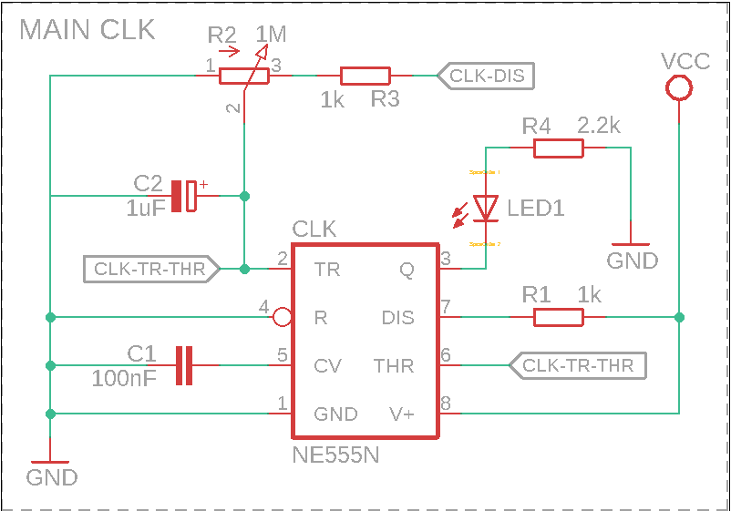

# Hardware Architecture Spec
## Overview
The main purpose of this document is to describe hardware architecture of presented solution.
This 8bit computer was created based on hight level architecture of MARIE computer described
in well-known book "The Essentials of Computer Organization and Architecture" written by
L.M. Null & J.M. Lobur. It was created for educational purposes.

## Clock
Main clock was done based on popular timer 555 designed by Hans Camenzind in 1971.
For this project we used NE555 IC (Integrated circuit) provided by Signetics.
However it can be easily replaced by for instance LM555 introduced by Texas Instruments.
Reference to the documentation may be found here:
- NE555: https://www.ti.com/lit/ds/symlink/ne555.pdf
- LM555: https://www.ti.com/lit/ds/symlink/lm555.pdf
It's also well described at [wiki page](https://en.wikipedia.org/wiki/555_timer_IC)

### Continous mode
Timer555 is running in astable mode. Mode used to continously stream of rectangular pulses in configured
period. This configuration is done by adding connection between THR (threshold) and TRIG (trigger) pins
plugged into voltage through the potentiometer (R2), resistor (R3) (which was added only to determine minimal
value of resistance - in a case when potentiometr was turned off (0 ohms), it's important for bipolar timers
555 to keep output saturated near the zero volts during discharge), resistor (R1) and capacitor (C2).
Connection is done  to keep same voltage on both pins (see `Note` below for more details). Duty cycle depends
on resistence of potentiometer, two resistors (R2 + R3, and R1) and value of capacitor (C2). The idea is
simple, capacitor voltage is triggering internal latch to change the state. From "1" to "0" during the time
of capacitor (C2) discharge and from "0" to "1" during capacitor charge. Time of charging/discharging of
capacitor depends on its capacity (expressed in farads) and resistance of potentiometr (R2) and resistors
(R3 and R1 - expressed in ohms). The bigger resistence the slower charging/discharging process because
capacitor have to pull (through the R2, R3, R1) / push (through the R2, R3) voltage. Same in terms of capacity,
the higher value of capacity the longer time needed to charge and discharge it. In that terms the potentiometr
(R2) was added to be able to easy change the frequency of the clocking signal that appears on pin Q (clock).

<div>
    
</div>

> __Note__:
>
> If the voltage lower below 1/3 Vcc on TR (trigger) pin it causes internal latch to change state of "Q" pin
> to "1" and capacitor starts charging through potentiometr (R2) and resistors (R3 + R1).
> Once capacitor reaches 2/3 Vcc the on THR (treshold) pin it causes internal latch to change state of "Q" pin
> to "0" and capacitor starts discharging throught potentiometr (R2) and resistor (R3).
> That is why it's important to keep same voltage on both pins TR and THR
> Internal transistors inside the timer are resposnsible for charge/discharge switching.

The time of signal "1" (high) of each pulse can be count as follow:

```math
t_h =  ln(2) * (R_1 + R_2 + R_3) * C_2
```

The time of signal "0" (low) of each pulse can be count as follow:

```math
t_l =  ln(2) * (R_2 + R_3) * C_2
```

In that terms frequency is:

```math
f = \frac{1}{t_1 +t2} = \frac{1}{ln(2) * (R_1 + 2(R_2 + R_3)) * C_2}
```

and duty cycle:

```math
D(%) = \frac{t_1}{t_1 +t2} * 100 = \frac{R_1 + R_2 + R_3}{R_1 + 2(R_2 + R_3)} * 100
```

### Stepping mode
TBD
